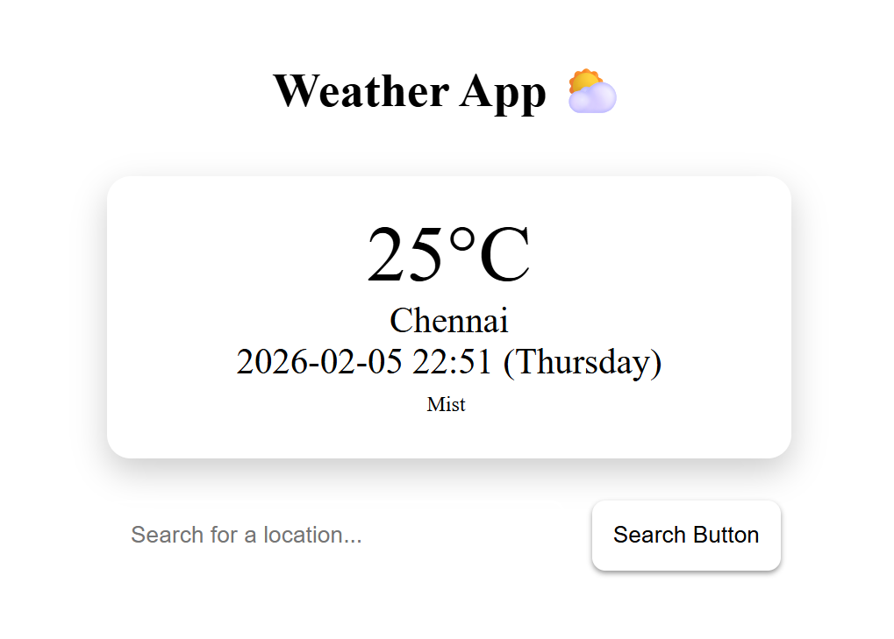

# Weather App ⛅

A responsive weather application that displays the **current temperature, location, local time, day, and weather condition** for any searched place using the WeatherAPI.

---

## 🚀 Live Demo
`https://sathyanarayanan-devs.github.io/Weather-App`

## 📷 Preview



## 🚀 Features
- Search weather by city or location name
- Displays:
  - Temperature (°C)
  - Location name
  - Local date & time
  - Day of the week
  - Weather condition (Sunny, Cloudy, Rainy, etc.)
- Responsive design (mobile, tablet, desktop)
- Handles:
  - Empty search input
  - Invalid location errors
  - Loading state while fetching data

---

## 🛠️ Built With
- **HTML5**
- **CSS3** (Flexbox + Media Queries)
- **JavaScript (ES6+)**
- **Fetch API**

---

## ⚙️ How It Works
1. User enters a location in the search box.
2. The app sends a request to WeatherAPI’s `current.json` endpoint.
3. Weather data is fetched asynchronously.
4. The UI updates dynamically with temperature, time, day, and condition.

---

## 📁 Project Structure
```text
weather-app/
├── index.html
├── style.css
└── script.js
```

---

## ▶️How to Run

1. Clone or download this repository.
2. Open **index.html** in any modern browser.

> Recommended: Use **Live Server** in VS Code for best experience.

---

## 🌐API Used

- WeatherAPI
    - Endpoint:
        `https://api.weatherapi.com/v1/current.json`

---

## 🔐Security Note

This project uses an API key directly inside `script.js`.

✔️ Acceptable for learning and personal projects.
❌ Not safe for production.

For real deployment, store the API key on a backend server or use a proxy server

---